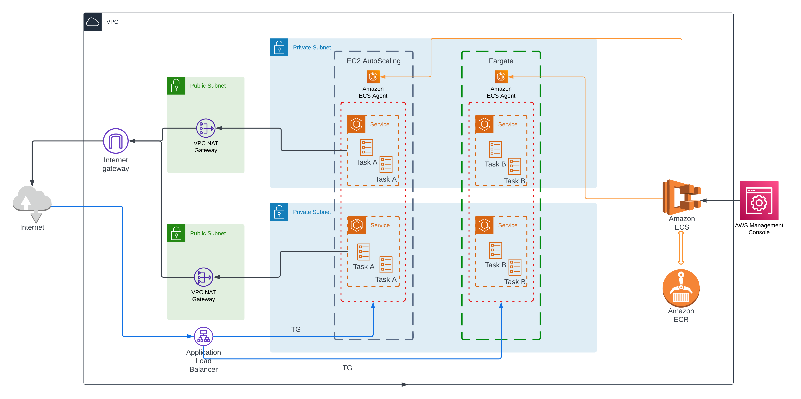

# Terraform Repository

This repository contains Terraform configuration files to provision an ECS cluster on AWS, including the necessary resources such as VPC, Application Load Balancer, and IAM roles.

## Architecture

## Prerequisites
Before using this Terraform configuration, make sure you have the following prerequisites:

1. Terraform installed on your local machine.
2. AWS account credentials with appropriate permissions to create resources.

## Files
The repository includes the following Terraform files:

* ECS.tf: This file defines the Terraform configuration for provisioning  an ECS cluster. It specifies the desired number of instances, instance type, and other relevant parameters.
* VPC.tf: This file contains the Terraform configuration for creating a VPC (Virtual Private Cloud) that will be used by the ECS cluster. It defines subnets, route tables, internet gateways, and other VPC-related resources.
* ALB.tf: This file contains the Terraform configuration for provisioning an Application Load Balancer (ALB) for the ECS cluster. It defines listeners, target groups, and other settings necessary to load balance traffic to the ECS services.
* IAM.tf: This file includes the Terraform configuration for creating IAM (Identity and Access Management) roles required for the ECS cluster. It defines roles and policies for granting appropriate permissions to the ECS instances and services.

## Usage

To use this Terraform configuration, follow these steps:

1. Clone this repository to your local machine.
2. Open a terminal and navigate to the cloned repository directory.
3. Run terraform init to initialize the Terraform environment.
4. Run terraform plan to preview the resources that will be created.
5. If the plan looks correct, run terraform apply to create the resources.
6. Review the changes that Terraform will apply and type "yes" to confirm.
7. Terraform will provision the ECS cluster, VPC, ALB, and IAM roles on AWS.

## Cleanup
To destroy the resources created by this Terraform configuration and avoid incurring unnecessary costs, follow these steps:

1. Open a terminal and navigate to the cloned repository directory.
2. Run 'terraform destroy' to destroy all the created resources.
3. Review the changes that Terraform will apply and type "yes" to confirm.
4. Terraform will delete the ECS cluster, VPC, ALB, and IAM roles from AWS.